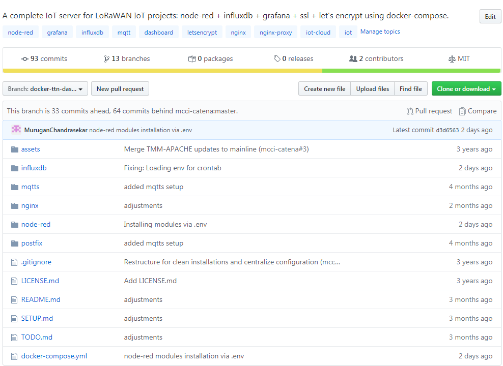
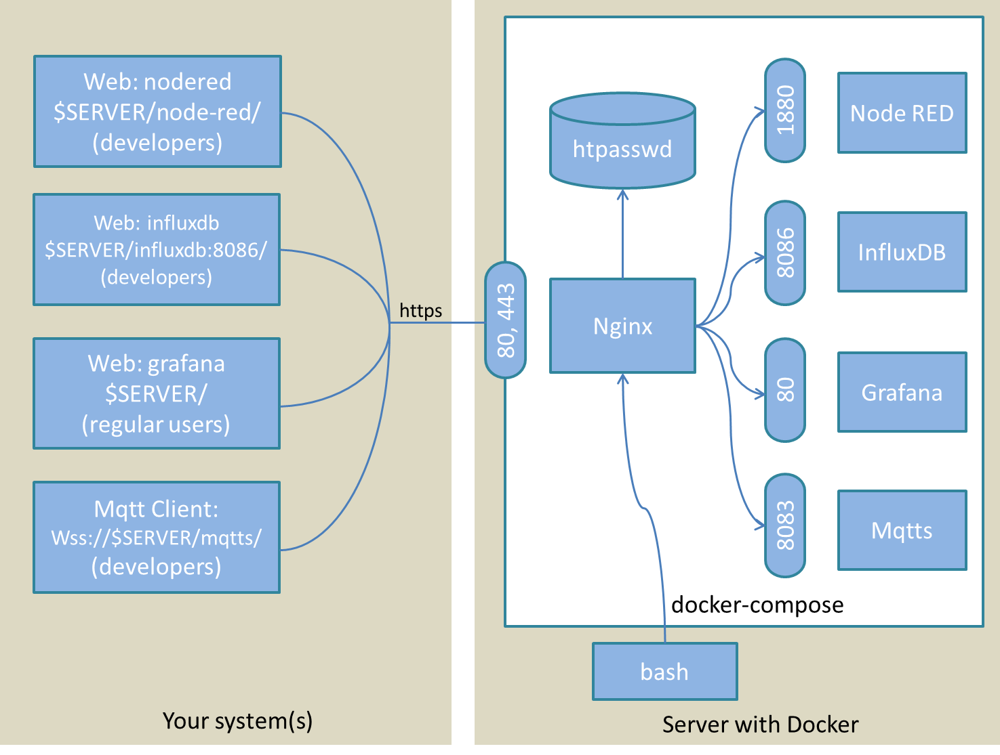

**PROPRIETARY NOTICE AND DISCLAIMER**

Unless noted otherwise, this document and the information herein disclosed are
proprietary to MCCI Corporation, 3520 Krums Corners Road, Ithaca, New York 14850
(“MCCI”). Any person or entity to whom this document is furnished or having
possession thereof, by acceptance, assumes custody thereof and agrees that the
document is given in confidence and will not be copied or reproduced in whole or
in part, nor used or revealed to any person in any manner except to meet the
purposes for which it was delivered. Additional rights and obligations regarding
this document and its contents may be defined by a separate written agreement
with MCCI, and if so, such separate written agreement shall be controlling.

The information in this document is subject to change without notice, and should
not be construed as a commitment by MCCI. Although MCCI will make every effort
to inform users of substantive errors, MCCI disclaims all liability for any loss
or damage resulting from the use of this manual or any software described
herein, including without limitation contingent, special, or incidental
liability.

MCCI, TrueCard, TrueTask, MCCI Catena, and MCCI USB DataPump are registered
trademarks of MCCI Corporation.

MCCI Instant RS-232, MCCI Wombat and InstallRight Pro are trademarks of MCCI
Corporation.

All other trademarks and registered trademarks are owned by the respective
holders of the trademarks or registered trademarks.

Copyright © 2020 by MCCI Corporation.

Document Release History

| Rev A | 2020-03-09 | Initial Release           |
|-------|------------|---------------------------|
| Rev B | 2020-03-19 | Updated relevant examples |

**Table of Contents**

[1 Introduction](#introduction)

[2 Application Server Installation](#application-server-installation)

[2.1 Definitions](#definitions)

[2.2 Security](#security)

[2.3 Assumptions](#assumptions)

[2.4 Composition and External Ports](#composition-and-external-ports)

[2.5 Data Files](#data-files)

[2.6 Reuse and removal of data files](#reuse-and-removal-of-data-files)

[2.7 Node-RED and Grafana Examples](#node-red-and-grafana-examples)

[2.7.1 Connecting to InfluxDB from Node-RED and
Grafana](#connecting-to-influxdb-from-node-red-and-grafana)

[2.7.2 Logging in to Grafana](#logging-in-to-grafana)

[2.7.3 Data source settings in Grafana](#data-source-settings-in-grafana)

[2.8 MQTTS Examples:](#mqtts-examples)

[3 Setup Instructions](#setup-instructions)

[3.1 Cloud-Provider Setup](#cloud-provider-setup)

[3.1.1 On Digital Ocean](#on-digital-ocean)

[Create droplet](#create-droplet)

[Configure droplet](#configure-droplet)

[3.2 After server is set up](#after-server-is-set-up)

[3.2.1 Create and edit the .env file](#create-and-edit-the.envfile)

[3.2.2 Set up the Node-RED and InfluxDB API
logins](#set-up-the-node-red-and-influxdb-api-logins)

[3.3 Start the server](#start-the-server)

[3.3.1 Restart servers in the background](#restart-servers-in-the-background)

[3.3.2 Initial testing](#initial-testing)

[3.3.3 Set up first data source](#set-up-first-data-source)

[3.3.4 Test Node-RED](#test-node-red)

[3.3.5 Creating an InfluxDB database](#creating-an-influxdb-database)

[3.3.6 Add Nginx log in for NodeRed or query after the
fact](#add-nginx-log-in-for-nodered-or-query-after-the-fact)

[3.3.7 MQTT User Credentials setup](#mqtt-user-credentials-setup)

**List of Tables**

Table 1 User Access 7

Table 2 Data Location 9

Table 3 Data Location Examples 10

**List of Figures**

Figure 1 Docker IoT Dashboard-GitHub Repository 5

Figure 2 Docker connection and User Access 8

**List of SeQUENCE Diagrams**

Introduction
============

This document explains the Application Server Installation and its setup.
[Docker](https://docs.docker.com/) and [Docker
Compose](https://docs.docker.com/compose/) are used to make the installation and
setup easier.

Application Server Installation 
================================

Refer [GitHub Page](https://github.com/mcci-catena/docker-iot-dashboard) to
Install and setup Application server in Docker using Docker Compose file.

>   Figure Docker IoT Dashboard-GitHub Repository

This repository contains a complete example that captures device data from The
Things Network, stores it in a database, and then displays the data using a
web-based dashboard.

The user can set this up on an "Ubuntu + Docker" VM from the Microsoft Azure
store (or on an Ubuntu VM from [Dream
Compute](https://www.dreamhost.com/cloud/computing/), or on a Docker droplet
from [Digital Ocean](https://www.digitalocean.com/)) with minimal effort. The
user should set up this service to run all the time so as to capture the data
from your devices; after which they can access the data at their convenience
using a web browser.

This dashboard uses docker-compose to set up a group of five primary docker
containers, backed by one auxiliary container:

1.  An instance of Nginx, which proxies the other services, handles access
    control, gets SSL certificates from [Let's
    Encrypt](https://letsencrypt.org/), and faces the outside world.

2.  An instance of [Node-RED](http://nodered.org/), which processes the data
    from the individual nodes, and puts it into the database.

3.  An instance of InfluxDB, which stores the data as time-series measurements
    with tags.

4.  An instance of [Grafana](http://grafana.org/), which gives a web-based
    dashboard interface to the data.

5.  An instance of [Mqtt](https://mosquitto.org/), which provides a lightweight
    method of carrying out messaging using a publish/subscribe model

The auxiliary container is:

1.  [Postfix](http://www.postfix.org/documentation.html), which (if configured)
    handles outbound mail services for the containers.

To make things more specific, most of the description here assumes use of
Microsoft Azure. However, this was tested on Ubuntu 16 with no issues (apart
from the additional complexity of setting up apt-get to fetch docker, and the
need for a manual install of docker-compose), on Dream Compute, and on Digital
Ocean This will work on any Linux or Linux-like platform that supports docker,
docker-compose, and Node-. Its likelihood of working with Raspberry Pi has not
been tested as yet.

Definitions
-----------

-   The **host system** is the system that runs Docker and Docker-compose.

-   A **container** is one of the virtual systems running under Docker on the
    host system.

-   A **file on the host** is a file present on the host system (typically not
    visible from within the container(s)).

-   A **file in container X** (or a **file in the X container**) is a file
    present in a file-system associated with container *X* (and typically not
    visible from the host system).

    1.  Security

All communication with the Nginx server is encrypted using SSL with
auto-provisioned certificates from Let's Encrypt. Grafana is the primary point
of access for most users, and Grafana's login is used for that purpose.

Access to Node-RED and InfluxDB is via special URLs (**base**/node-red/
and **base**/influxdb:8086/, where **base** is the URL served by the Nginx
container).

These URLs are protected via Nginx htpasswd file entries. These entries are
files in the Nginx container, and must be manually edited by an Administrator.

The initial administrator's login password for Grafana must be initialized prior
to starting; it's stored in grafana/.env. (When the Grafana container is started
for the first time, it creates grafana.db in the Grafana container, and stores
the password at that instance. If grafana.db already exists, the password
in grafana/.env is ignored.)

Microsoft Azure, by default, will not open any of the ports to the outside
world, so the user will need to open port 443 for SSL access to Nginx.

For concreteness, the following table assumes
that **base** is “server.example.com”.

>   Table User Access

| **To access**        | **Open this link**                                        | **Notes**                                                                                                 |
|----------------------|-----------------------------------------------------------|-----------------------------------------------------------------------------------------------------------|
| Node-RED             | <https://server.example.com/node-red/>                    | Port number is not needed and shouldn't be used. Note trailing '/' after node-red.                        |
| InfluxDB API queries | <https://server.example.com/influxdb:8086/>               | Port number is needed. Also note trailing '/' after influxdb.                                             |
| Grafana              | [https://server.example.com](https://server.example.com/) | Port number is not needed and shouldn't be used.                                                          |
| Mqtt                 | wss://server.example.com/mqtts/                           | Mqtt client is needed. To test it via [Mqtt web portal](https://www.eclipse.org/paho/clients/js/utility/) |

This can be visualized as shown in the figure below:

Figure Docker connection and User Access

Assumptions
-----------

-   The host system must have docker-compose verison 1.9 or later (for which
    <https://github.com/docker-compose> -- be aware that apt-get normally
    doesn't grab this; if configured at all, it frequently gets an out-of-date
    version).

-   The environment variable IOT_DASHBOARD_DATA, if set, points to the common
    directory for the data. If not set, docker-compose will quit at start-up.
    (This is by design!)

    -   \${IOT_DASHBOARD_DATA}node-red will have the local Node-RED data.

    -   \${IOT_DASHBOARD_DATA}influxDB  will have the local InfluxDB data (this
        should be backed-up)

    -   \${IOT_DASHBOARD_DATA}grafana will have all the dashboards

    -   \${IOT_DASHBOARD_DATA}mqtt/credentials will have the user credentials

    1.  Composition and External Ports

Within the containers, the individual programs use their usual ports, but these
are isolated from the outside world, except as specified by docker-compose.yml
file.

In docker-compose.yml, the following ports on the docker host are connected to
the individual programs.

-   Nginx runs on 80 and 443. (All connections to port 80 are redirected to 443
    using SSL).

Remember, if the server is running on a cloud platform like Microsoft Azure or
AWS, one needs to check the firewall and confirm that the ports are open to the
outside world.

Data Files
----------

When designing this collection of services, there were two choices to store the
data files:

-   To keep them inside the docker containers, or

-   To keep them in locations on the host system.

The advantage of the former is that everything is reset when the docker images
are rebuilt. The disadvantage of the former is that there is a possibility to
lose all the data when it’s rebuilt.

On the other hand, there's another level of indirection when keeping things on
the host, as the files reside in different locations on the host and in the
docker containers.

Data files are kept in the following locations by default.

Table Data Location

| **Component** | **Data file location on host**         | **Location in container**  |
|---------------|----------------------------------------|----------------------------|
| Node-RED      | \${IOT_DASHBOARD_DATA}node-red         | /data                      |
| InfluxDB      | \${IOT_DASHBOARD_DATA}influxdb         | /data                      |
| Grafana       | \${IOT_DASHBOARD_DATA}grafana          | /var/lib/grafana           |
| Mqtt          | \${IOT_DASHBOARD_DATA}mqtt/credentials | /etc/mosquitto/credentials |

As shown, one can easily change locations on the **host** (e.g. for testing).
This can be done by setting the environment variable IOT_DASHBOARD_DATA to
the **absolute path** (with trailing slash) to the containing directory prior to
calling docker-compose up. The above paths are appended to the value
of IOT_DASHBOARD_DATA. Directories are created as needed.

Normally, this is done by an appropriate setting in the .env file.

Consider the following example:

>   \$ grep IOT_DASHBOARD_DATA .env

>   IOT_DASHBOARD_DATA=/dashboard-data/

>   \$ docker-compose up –d

In this case, the data files are created in the following locations:

Table Data Location Examples

| **Component** | **Data file location**            |
|---------------|-----------------------------------|
| Node-RED      | /dashboard-data/node-red          |
| InfluxDB      | /dashboard-data/influxdb          |
| Grafana       | /dashboard-data/grafana           |
| Mqtt          | /dashboard-data/ mqtt/credentials |

Reuse and removal of data files
-------------------------------

Since data files on the host are not removed between runs, as long as the files
are not removed between runs, the data will be preserved.

Sometimes this is inconvenient, and it is necessary to remove some or all of the
data. For a variety of reasons, the data files and directories are created owned
by root, so the sudo command must be used to remove the data files. Here's an
example of how to do it:

>   source .env

>   sudo rm -rf \${IOT_DASHBOARD_DATA}node-red

>   sudo rm -rf \${IOT_DASHBOARD_DATA}influxdb

>   sudo rm -rf \${IOT_DASHBOARD_DATA}Grafana

>   sudo rm –rf \${IOT_DASHBOARD_DATA}mqtt/credentials

Node-RED and Grafana Examples
-----------------------------

This version requires a Node-RED setup, the database and the Grafana dashboards
manually, but a reasonable set of initial files in a future release needs to be
added.

### Connecting to InfluxDB from Node-RED and Grafana

There is one point that is somewhat confusing about the connections from
Node-RED and Grafana to InfluxDB. Even though InfluxDB is running on the same
host, it is logically running on its own virtual machine (created by docker).
Because of this, Node-RED and Grafana cannot use local host when connecting to
Grafana. A special name is provided by docker:influxdb. Note that there's no DNS
suffix. If InfluxDB is not used, Node-RED and Grafana will not be able to
connect.

### Logging in to Grafana

On the login screen, the user name is "admin". The initial password is given by
the value of the variable GF_SECURITY_ADMIN_PASSWORD in grafana/.env. Note that
if you change the password in grafana/.env after the first time you launch the
grafana container, the admin password does not change. If you somehow lose the
previous value of the admin password, and you don't have another admin login,
it's very hard to recover; easiest is to remove grafana.db and start over.

### Data source settings in Grafana

-   Set the URL (under HTTP Settings) to <http://influxdb:8086>.

-   Select the database.

-   Leave the username and password blank.

-   Click "Save & Test".

    1.  MQTTS Examples:

Mqtts has been configured to access in the below channel:

1.  MQTT over Nginx proxy:

Host: dashboard.example.com Port: 443

Path: /mqtts/

Username/Password directs to mosquitto’s configuration (password_file)

1.  MQTT over TLS/SSL:

>   Host: dashboard.example.com Port: 8883

Username/Password directs to mosquitto’s configuration (password_file)

1.  WebSockets over TLS/SSL:

Host: dashboard.example.com Port: 8083

Username/Password directs to mosquitto’s configuration password_file)

1.  MQTT over TCP protocol:

Host: dashboard.example.com Port: 1883

>   Username/Password directs to mosquitto’s configuration (password_file)

To test the above channels, user needs [mosquitto
client](https://mosquitto.org/download/) tool except the first one: “MQTT over
Nginx proxy”. In order to test the “MQTT over Nginx proxy”, user needs to access
[mqtt web portal](https://www.eclipse.org/paho/clients/js/utility/) tool.

Setup Instructions
==================

**Notes:**

For example, if the dashboard server name: dashboard.example.com

Other things are to be named consistently:

-   /opt/docker/dashboard.example.com is the directory (on the host system)
    containing the docker files.

-   /var/opt/docker/dashboard.example.com is the directory (on the host system)
    containing persistent data.

-   Node-RED familiarity is assumed.

    1.  Cloud-Provider Setup

As an initial step, a cloud provider is required and Docker and Docker-Compose
must be installed which is provider dependent.

### On Digital Ocean

#### Create droplet

1.  Log in to [Digital Ocean](https://cloud.digitalocean.com/)

2.  Create a new project (if needed) to hold the new droplet.

3.  Discover \> Marketplace, search for Docker

4.  This page will be redirected:
    <https://cloud.digitalocean.com/marketplace/5ba19751fc53b8179c7a0071?i=ec3581>

5.  Press "Create"

6.  Select the standard 8G GB Starter that is selected.

7.  Choose a datacenter; *New York is selected in the example created for this
    document.*

8.  Additional options: none.

9.  Add the SSH keys.

10. Choose a host name, *e.g. passivehouse-ecovillage.*

11. Select the project.

12. Press "Create"

#### Configure droplet

1.  Note the IP address from above.

2.  ssh root\@{ipaddress}

3.  Remove the motd (message of the day).

4.  Add user:

>   adduser username

>   adduser username admin

>   adduser username docker

>   adduser username plugdev

>   adduser username staff

1.  Disable root login via SSH or via password

2.  Optional: enable username to sudo without password.

>   sudo VISUAL=vi visudo

>   Add the following line at the bottom:

>   username ALL=(ALL) NOPASSWD: ALL

1.  Test that you can become username:

>   \# sudo -i username

>   username\@host-name:\~\$

1.  Drop back to root, and then copy the authorized_keys file to \~username:

>   mkdir -m 700 \~username/.ssh

>   cp -p .ssh/authorized_keys \~username/.ssh

>   chown -R username.username \~username/.ssh/authorized_keys

1.  Confirm if the user can SSH in.

2.  Optional: set up byobu by default:

>   byobu

>   byobu-enable

1.  Set the host name.

>   vi /etc/hosts

>   Change the line 127.0.1.1 name name to 127.0.0.1 myhost.myfq.dn myhost.

1.  If needed, use hostnamectl to set the static hostname to match myhost.

2.  set up Git:

>   sudo add-apt-repository ppa:git-core/ppa

>   sudo apt update

>   sudo apt install git

1.  We'll put the docker files at /opt/docker/docker-iot-dashboard, setting up
    as follows:

>   sudo mkdir /opt/docker

>   cd /opt/docker

>   sudo chgrp admin .

>   sudo chmod g+w .

After server is set up
----------------------

The following instructions are essentially independent of the cloud provider and
the underlying distribution. But this was only tested on Ubuntu and (in 2017) on
CentOS.

1.  Clone this repository.

>   git clone git\@github.com:mcci-catena/docker-iot-dashboard.git
>   /opt/docker/dashboard.example.com

1.  Move to the directory populated in step 1.

>   cd /opt/docker/dashboard.example.com

1.  Get a fully-qualified domain name (FQDN) for the server, for which the DNS
    can be controlled. Point it to the server. Make sure it works, using "dig
    FQDN" -- get back an A record pointing to your server's IP address.

    1.  Create and edit the .env file

2.  Create a .env file. To get a template:

>   sed -ne '/\^\#+++/,/\^\#---/p' docker-compose.yml \| sed -e '/\^\#[\^
>   \\t]/d' -e '/\^\# IOT/s/\$/=/' \> .env

1.  Edit the .env file as follows:

    1.  IOT_DASHBOARD_NGINX_FQDN=myhost.example.com  this sets the name of the
        resulting server. It tells Nginx what it's serving out. It must be a
        fully-qualified domain name (FQDN) that resolves to the IP address of
        the container host.

    2.  IOT_DASHBOARD_CERTBOT_FQDN=myhost.example.com  this should be the same
        as IOT_DASHBOARD_NGINX_FQDN.

    3.  IOT_DASHBOARD_CERTBOT_EMAIL=someone\@example.com  this sets the contact
        email for Let's Encrypt. The script automatically accepts the Let's
        Encrypt terms of service, and this indicates who is doing the accepting.

    4.  IOT_DASHBOARD_DATA=/full/path/to/directory/  the trailing slash is
        required! This will put all the data file for this instance as
        subdirectories of the specified path. If this is
        undefined, docker-compose will print error messages and quit.

    5.  IOT_DASHBOARD_GRAFANA_ADMIN_PASSWORD= this needs to be confidential.
        Indeed this sets the *initial* password for the Grafana admin login.
        This should be changed via the Grafana UI after booting the server.

    6.  IOT_DASHBOARD_GRAFANA_SMTP_FROM_ADDRESS   this sets the Grafana
        originating mail address.

    7.  IOT_DASHBOARD_GRAFANA_INSTALL_PLUGINS  this sets a list of Grafana
        plugins to install.

    8.  IOT_DASHBOARD_INFLUXDB_INITIAL_DATABASE_NAME=demo  Change "demo" to the
        desired name of the initial database that will be created in InfluxDB.

    9.  IOT_DASHBOARD_MAIL_HOST_NAME=myhost.example.com  this sets the name of
        your mail server. Used by Postfix.

    10. IOT_DASHBOARD_MAIL_DOMAIN=example.com  this sets the domain name of your
        mail server. Used by Postfix.

    11. IOT_DASHBOARD_NODERED_INSTALL_PLUGINS=node-red-node-example1
        node-red-node-example2  this installs one or more Node-RED plug-ins.

    12. IOT_DASHBOARD_TIMEZONE=Europe/Paris  If not defined, the default time
        zone will be GMT.

The .env file should look like this:

\#\#\# env file for configuring dashboard.example.com

IOT_DASHBOARD_NGINX_FQDN=dashboard.example.com

\# The fully-qualified domain name to be served by Nginx.

\#

\# IOT_DASHBOARD_AWS_ACCESS_KEY_ID=

\# The access key for AWS for backups.

\#

\# IOT_DASHBOARD_AWS_DEFAULT_REGION=

\# The AWS default region.

\#

\# IOT_DASHBOARD_AWS_S3_BUCKET_INFLUXDB=

\# The S3 bucket to use for uploading the influxdb backup data.

\#

\# IOT_DASHBOARD_AWS_SECRET_ACCESS_KEY=

\# The AWS API secret key for backing up influxdb data.

\#

IOT_DASHBOARD_CERTBOT_EMAIL=somebody\@example.com

\# The email address to be used for registering with Let's Encrypt.

\#

IOT_DASHBOARD_CERTBOT_FQDN=dashboard.example.com

\# The domain(s) to be used by certbot when registering with Let's Encrypt.

\#

IOT_DASHBOARD_DATA=/var/opt/docker/dashboard.example.com/

\# The path to the data directory. This must end with a '/', and must either

\# be absolute or must begin with './'. (If not, you'll get parse errors.)

\#

IOT_DASHBOARD_GRAFANA_ADMIN_PASSWORD=...................

\# The password to be used for the admin user on first login. This is ignored

\# after the Grafana database has been built.

\#

IOT_DASHBOARD_GRAFANA_PROJECT_NAME=My Dashboard

\# The project name to be used for the emails from the administrator.

\#

\# IOT_DASHBOARD_GRAFANA_LOG_MODE=

\# Set the grafana log mode.

\#

\# IOT_DASHBOARD_GRAFANA_LOG_LEVEL=

\# Set the grafana log level (e.g. debug)

\#

IOT_DASHBOARD_GRAFANA_SMTP_ENABLED=true

\# Set to true to enable SMTP.

\#

\# IOT_DASHBOARD_GRAFANA_SMTP_SKIP_VERIFY=

\# Set to true to disable SSL verification.

\# Defaults to false.

\#

\# IOT_DASHBOARD_GRAFANA_INSTALL_PLUGINS=

\# A list of grafana plugins to install.

\#

IOT_DASHBOARD_GRAFANA_SMTP_FROM_ADDRESS=grafana-admin\@dashboard.example.com

\# The "from" address for Grafana emails.

\#

\# IOT_DASHBOARD_GRAFANA_USERS_ALLOW_SIGN_UP=

\# Set to true to allow users to sign-up to get access to the dashboard.

\#

IOT_DASHBOARD_INFLUXDB_ADMIN_PASSWORD=jadb4a4WH5za7wvp

\# The password to be used for the admin user by influxdb. Again, this is

\# ignored after the influxdb database has been built.

\#

IOT_DASHBOARD_INFLUXDB_INITIAL_DATABASE_NAME=mydatabase

\# The inital database to be created on first launch of influxdb. Ignored

\# after influxdb has been launched.

\#

IOT_DASHBOARD_MAIL_DOMAIN=example.com

\# the postfix mail domain.

\#

IOT_DASHBOARD_MAIL_HOST_NAME=dashboard.example.com

\# the external FQDN for the mail host.

\#

\# IOT_DASHBOARD_MAIL_RELAY_IP=

\# the mail relay machine, assuming that the real mailer is upstream from us.

\#

IOT_DASHBOARD_NODERED_INSTALL_PLUGINS=node-red-node-example1
nodered-node-example2

\# Additional plugins to be installed for Node-RED.

\#

\# IOT_DASHBOARD_PORT_HTTP=

\# The port to listen to for HTTP. Primarily for test purposes. Defaults to

\# 80.

\#

\# IOT_DASHBOARD_PORT_HTTPS=

\# The port to listen to for HTTPS. Primarily for test purposes. Defaults to

\# 443.

\#

\# IOT_DASHBOARD_TIMEZONE=

\# The timezone to use. Defaults to GMT.

### Set up the Node-RED and InfluxDB API logins

1.  Prepare everything:

>   docker-compose pull

>   docker-compose build

>   If there are any errors, they need to be fixed before going on.

1.  Use docker-compose run nginx /bin/bash to launch a shell in the Nginx
    context.

    -   If this fails with the message, ERROR: Couldn't connect to Docker daemon
        at http+docker://localunixsocket - is it running?, then probably the
        user ID is not in the docker group. To fix this, sudo adduser MYUSER
        docker, where "MYUSER" is the login ID. Then (**very important**) log
        out and log back in.

2.  Change ownership of Nginx's /etc/nginx/authdata to user www-data.

>   chown www-data /etc/nginx/authdata

1.  Add Nginx's /etc/nginx/authdata/.htpasswd.

>   touch /etc/nginx/authdata/.htpasswd

>   chown www-data /etc/nginx/authdata/.htpasswd

1.  Add user logins for node-red and influxdb queries. Make USERS be a list of
    login IDs.

>   export USERS="tmm amy josh"

>   for USER in \$USERS; do echo "Set password for "\$USER; htpasswd
>   /etc/nginx/authdata/.htpasswd \$USER; done

1.  Exit Nginx's container with Control+D.

    1.  Start the server

2.  Starting things up in "interactive mode" is recommended.

>   docker-compose up

>   This will show the log files. It will also be pretty clear if there are any
>   issues.

>   One common error (for me, anyway) is entering an illegal initial InfluxDB
>   database name. InfluxDB will spew a number of errors, but eventually it will
>   start up anyway. But then the database needs to be created manually.

### Restart servers in the background

Once the servers are coming up interactively, use \^C to shut them down, and
then restart in daemon mode.

>   docker-compose up -d

### Initial testing

-   Open Grafana
    on [https://dashboard.example.com](https://dashboard.example.com/), and log
    in as admin.

-   Change the admin password.

    1.  Set up first data source

Use the Grafana UI -- either click on "add first data source" or use
"Configure\>Add Data Source", and add an InfluxDB data source.

-   Set the URL (under HTTP Settings) to <http://influxdb:8086>.

-   Select the database. If InfluxDB is properly initialized in a database,
    connect to it as a Grafana data source. If not, [create an InfluxDB
    database](https://github.com/mcci-catena/docker-iot-dashboard/blob/master/SETUP.md#creating-an-influxdb-database).

-   Leave user and password blank.

-   Click "Save & Test".

    1.  Test Node-RED

Open Node-RED on <https://dashboard.example.com/node-red/>, and build a flow
that stores data in InfluxDB. **Be sure to add the trailing slash! Otherwise a
404 error pops from Grafana. This will be fixed soon.**

### Creating an InfluxDB database

To create a database, log in to the host machine, and cd
to /opt/docker/dashboard.example.com. Use the following commands:

>   \$ docker-compose exec influxdb /bin/bash

>   \# influx

>   Connected to http://localhost:8086 version 1.7.6

>   InfluxDB shell version: 1.7.6

>   Enter an InfluxQL query

>   \> show databases

>   name: databases

>   name

>   \----

>   \_internal

>   \> create database "my-new-database"

>   \> show databases

>   name: databases

>   name

>   \----

>   \_internal

>   my-new-database

>   \> \^D

>   \# \^D

>   \$

### Add Nginx log in for NodeRed or query after the fact

To add a user with Node-RED access or query access, follow this procedure.

1.  Log into the host machine

2.  Change the directory (cd) to /opt/docker/dashboard.example.com.

3.  log into the Nginx docker container.

>   \$ docker-compose exec Nginx /bin/bash

1.  In the container, move to the authdata directory.

>   \# cd /etc/nginx/authdata

1.  Add the user.

>   \# htpasswd .htpasswd {newuserid}

>   New password:

>   Re-type new password:

>   Adding password for user {newuserid}

1.  Close the connection to nginx (Ctrl+D).

    1.  MQTT User Credentials setup

To access mqtt channel, user needs credentials to access it.

1.  Log into the host machine

2.  Change the directory (cd) to /opt/docker/dashboard.example.com.

3.  log into the mqtts docker container.

>   \$ docker-compose exec mqtts /bin/bash

1.  In the container,

>   \# mosquitto_passwd -c /etc/mosquitto/credentials/passwd \<user\>

>   Password:

>   Reenter password:

1.  Close the connection to mqtts (Ctrl+D).
